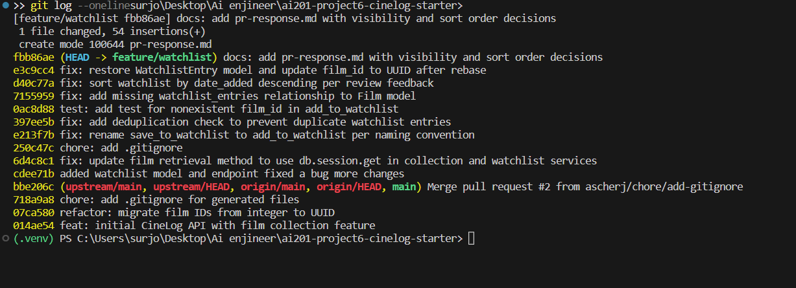

# PR Response Doc — CineLog Watchlist Feature

## AI Usage
I used Claude to help with summarizing what each file is responsible for, who the models and functions interact with. I asked question on places where i thought the code didnt make sense, or i was confused with how it interacts with other files. I also asked questions about different formats like that of the int vs UUID. At the end I verified the finding with gemini. 
For Comments 4 and 5, I wrote my initial position first, then used Claude 
to stress-test it by asking what a careful reviewer might push back on. 
For Comment 4, this surfaced that the public flag currently has no 
enforcement (no auth check on the watchlist endpoint), which sharpened my 
reasoning toward defaulting to False rather than just asserting a "social 
app" framing. For Comment 5, being pushed to distinguish a watchlist from 
a collection (aspirational vs. already-watched) led me to reconsider and 
reject my first instinct (oldest-first, queue-style) in favor of 
newest-first.

## Comment 1 — Rename
**What I did:** Renames _save_to_watchlist() to add_to_watchlist() in services/watchlist_service.py to match the verb_to_noun naming convention used by add_to_collection(). Updated the import and call site in routes/watchlist/watchlist.py.
**How I verified:** an `git grep -n "save_to_watchlist"` across the repo 
to confirm no references remained. Ran `pytest tests/ -v` — all 4 existing 
tests passed.

## Comment 2 — Deduplication
**What I did:** Added a query in add_to_watchlist() that checks for an existing WatchlistEntry with the same user_id and film_id before creating a new one, raising a new AlreadyInWatchlistError if found — mirroring the same pattern used in add_to_collection() (application-level check via filter_by().first(), not a DB constraint).
**How I verified:** Ran pytest tests/ -v to confirm the existing test suite still passes with no regressions.

## Comment 3 — Missing test
**What I did:** Created tests/test_watchlist.py, mirroring the fixture and structure of test_collection.py. Added test_add_to_watchlist_nonexistent_film_raises, modeled directly on test_add_to_collection_nonexistent_film_raises.
**How I verified:** Ran pytest tests/test_watchlist.py -v to confirm the 
new test passes, then pytest tests/ -v to confirm no regressions across 
the full suite. Note: initially used a fake integer film_id (99999) since 
Film.id was still an integer pre-rebase. Updated to a UUID-shaped string 
during Comment 6 once Film.id was migrated to UUID.

## Comment 4 — Default visibility
**My position:** my position is that default should be false.
**Reasoning:**  currently GET /watchlist/<user_id> has no authentication check, so public isnt doing anything today. anyone can see anybody's list regardless fo the flag. 'False' would be safer right now as the tradeoff in case it fails is that less than desired information is shared; rather than more than desired info incase of 'true'
**Tradeoff acknowledged:** currently defaulting to 'false' has no tradeoff. In future, if a "friends current watchlist" or similar feature is added, it will show nothing until the flag is changed again.

## Comment 5 — Sort order
**My position:** my position is date-added, newest-first.
**Reasoning:**  I agree with the maintainer's position that date added newest first, makes the most sense. People add movies to the list based on their current interest. theres a recency bias. So sorting movies in the watchlist according to that makes the most sense to me.
**Engagement with reviewer's point:** it is consistent with get_collection() which already uses date_added.desc(). I also considered alphabetic or maybe date_added.asc() because users might want to start from the beginning and finish up old movies or movies added a long time ago, but that likely wont be the most or base scenario, rather a once in a while thing.

## Comment 6 — Rebase
**What conflicted:**  Rebasing onto upstream/main surfaced a real conflict in 
.gitignore (both branches independently added one; resolved by merging both 
lists). More significantly, main's UUID refactor commit had also removed the 
WatchlistEntry class entirely from models.py in the same commit that migrated 
Film.id to a UUID. Because my later commits only added adjacent lines (e.g., 
the watchlist_entries relationship) rather than editing the WatchlistEntry 
class itself, git's line-based diffing never flagged this as a conflict — 
after the rebase completed "successfully," WatchlistEntry was silently 
missing from models.py.
**How I resolved it:**Confirmed the class was actually absent from my working 
directory (not just a display issue) using git grep and git show on individual 
commits. Re-added the WatchlistEntry class, updating film_id from db.Integer 
to db.String(36) to match the refactored Film.id. Also updated 
test_watchlist.py's fake_film_id from an integer to a UUID-shaped string, 
since the old value only passed by coincidence (SQLite doesn't strictly 
enforce column types).
**How I verified no conflict remains:**Ran pytest tests/ -v — all 6 tests 
pass. Reviewed watchlist_service.py and routes/watchlist/watchlist.py for 
any remaining stale references to integer film_ids in docstrings/comments; 
both were already consistent with the UUID model.

## Additional test (stretch)
**What I did:** Added test_get_watchlist_returns_newest_first, mirroring 
test_get_collection_returns_newest_first, to verify the Comment 5 sort 
order change.
**Why this case:** This test is the first one to actually exercise 
get_watchlist() with real data. It uncovered a pre-existing bug: Film had 
a relationship for collection_entries but none for watchlist_entries, so 
entry.film raised an AttributeError. Added the missing 
watchlist_entries = db.relationship("WatchlistEntry", backref="film", lazy=True) 
line to Film in models.py to fix it — this bug was unrelated to the sort 
order change itself, just uncovered by writing a test that finally called 
get_watchlist() end-to-end.

## PR Description
What this feature does
Adds a watchlist feature so users can save films they intend to watch,
view their watchlist, and remove films from it. This is separate from
the existing collection feature (films already watched).

Design decisions
Default visibility (public): Defaults to False. The
GET /watchlist/<user_id> endpoint currently has no authentication
check, meaning anyone can view any user's watchlist regardless of the
public flag — the flag isn't enforced anywhere yet. Given that, a
private-by-default is the safer choice until access control exists:
exposing everything by default risks silently surfacing data users
didn't intend to share, while defaulting private only costs some
"cold start" visibility if a future discovery/social feature is built
on top of this later.

Sort order: Watchlist results are sorted by date_added descending
(newest first), matching the existing convention in
get_collection(). Recently added films are more likely to reflect a
user's current interest, which is more useful for a watchlist (films
not yet watched) than alphabetical ordering.

How to test manually
Start the app: python app.py
Create a user and film (via existing endpoints, or directly in a
Python/Flask shell) to get a user_id and film_id.
Add a film to the watchlist:
curl -X POST http://127.0.0.1:5000/watchlist/<user_id>/add
-H "Content-Type: application/json"
-d '{"film_id": "<film_id>"}'
View the watchlist (should return the film, sorted newest-first if
multiple entries exist):
curl http://127.0.0.1:5000/watchlist/<user_id>
Try adding the same film again — should return an error rather than
a duplicate entry (AlreadyInWatchlistError).
Try adding a nonexistent film_id — should return an error
(FilmNotFoundError), not a 500.
Run the automated test suite:
pytest tests/ -v
All tests should pass.

## Commit History

